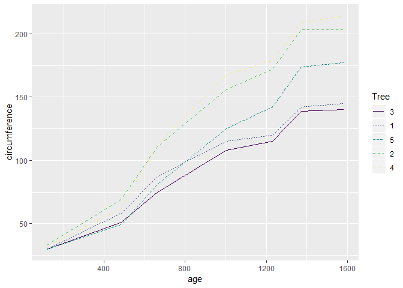

hw01\_orange
================

### Exploring the Orange dataset:

``` r
head(Orange, 10)
```

    ##    Tree  age circumference
    ## 1     1  118            30
    ## 2     1  484            58
    ## 3     1  664            87
    ## 4     1 1004           115
    ## 5     1 1231           120
    ## 6     1 1372           142
    ## 7     1 1582           145
    ## 8     2  118            33
    ## 9     2  484            69
    ## 10    2  664           111

``` r
tail(Orange, 3) 
```

    ##    Tree  age circumference
    ## 33    5 1231           142
    ## 34    5 1372           174
    ## 35    5 1582           177

``` r
summary(Orange$age) 
```

    ##    Min. 1st Qu.  Median    Mean 3rd Qu.    Max. 
    ##   118.0   484.0  1004.0   922.1  1372.0  1582.0

``` r
summary(Orange[c(1:10), ])
```

    ##  Tree       age         circumference   
    ##  3:0   Min.   : 118.0   Min.   : 30.00  
    ##  1:7   1st Qu.: 484.0   1st Qu.: 60.75  
    ##  5:0   Median : 664.0   Median : 99.00  
    ##  2:3   Mean   : 772.1   Mean   : 91.00  
    ##  4:0   3rd Qu.:1174.2   3rd Qu.:118.75  
    ##        Max.   :1582.0   Max.   :145.00

``` r
class(Orange$Tree)
```

    ## [1] "ordered" "factor"

``` r
levels(Orange$Tree)
```

    ## [1] "3" "1" "5" "2" "4"

``` r
length(levels(Orange$Tree))
```

    ## [1] 5

``` r
Orange$circumference[Orange$Tree == "3"] == Orange$circumference[Orange$Tree == "1"]
```

    ## [1]  TRUE FALSE FALSE FALSE FALSE FALSE FALSE

``` r
Orange[Orange$Tree=="5",]
```

    ##    Tree  age circumference
    ## 29    5  118            30
    ## 30    5  484            49
    ## 31    5  664            81
    ## 32    5 1004           125
    ## 33    5 1231           142
    ## 34    5 1372           174
    ## 35    5 1582           177

### Plotting the data:

``` r
library("ggplot2")
ggplot(Orange, aes(x=age, y=circumference, group=Tree)) + geom_line(aes(linetype=Tree, color=Tree))
```


